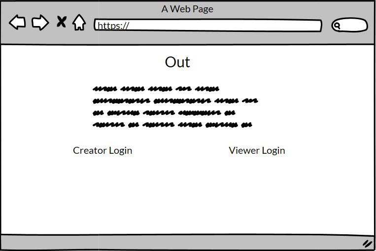
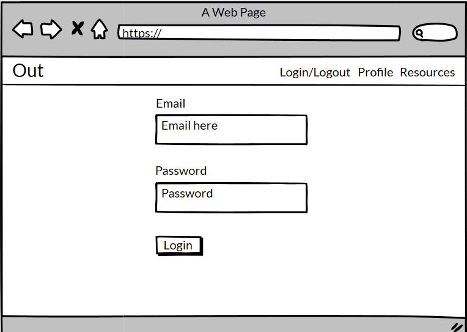
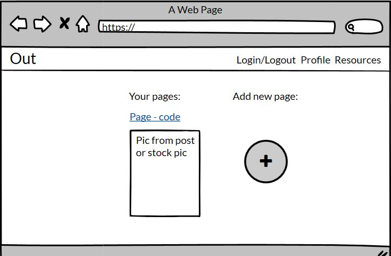
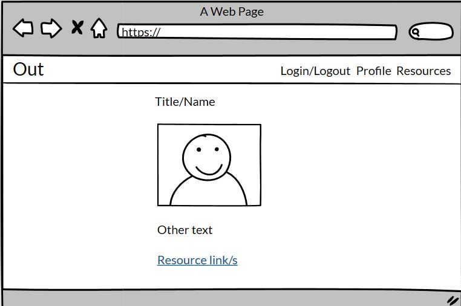
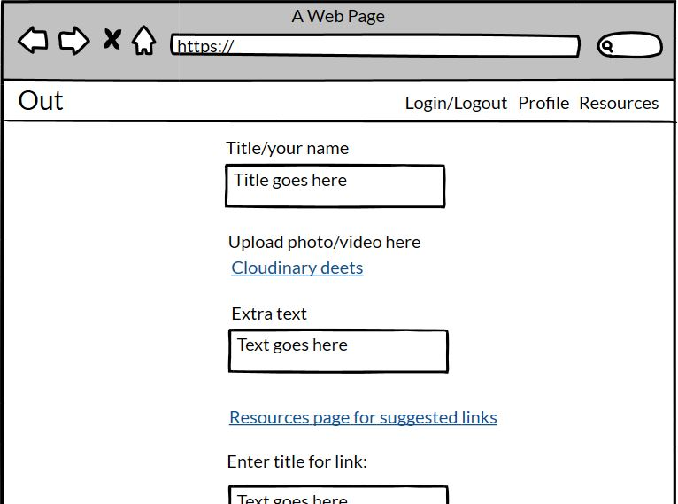
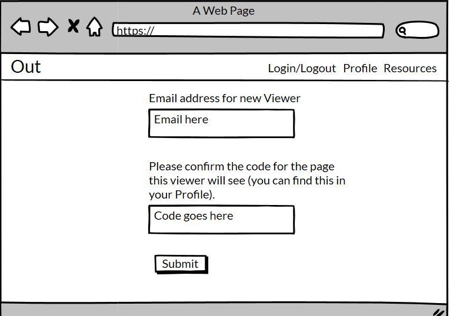
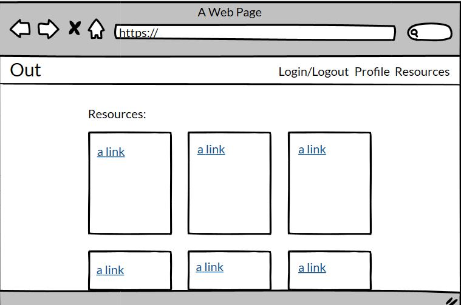
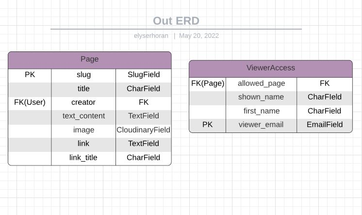
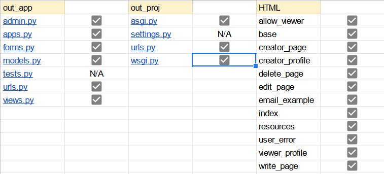
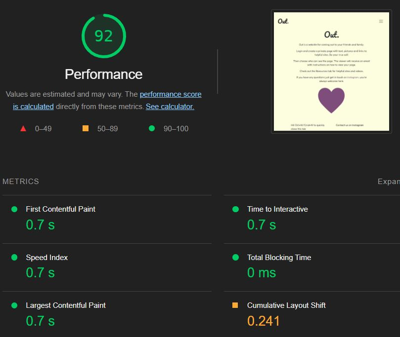

### Table of contents:

[Theme, Epic and User Stories](#theme-epic-and-user-stories) 

[Design and UX](#design-and-ux) 
* [Wireframes](#wireframes)
* [Database model](#database-model)

[Features](#features)

[Future Features](#future-features)

[Technologies](#technologies)

[Testing ](#testing)
* [Code Validation](#code-validation)
* [Browser Compatibility](#browser-compatibility)
* [Accessibility Testing](#accessibility-testing)
* [Performance Testing](#performance-testing)
* [Manual Testing](#manual-testing)
* [User Stories Testing](#user-stories-testing)

[Debugging and known bugs](#debugging-and-known-bugs)

[Deployment](#deployment)

[Credits](#credits)

[Resources](#resources)

[Acknowledgements](#acknowledgements)

Live link:
[Out.](https://out-proud.herokuapp.com/)

Screenshot:

### Theme, Epic and User Stories

**Theme**

A website to assist individuals in safely coming out as LGBTQ+.

**Epic**

The website allows the user, going forward known as the Creator, the ability to create a private page which can securely be sent to other users, known as Viewers. Only specified Viewers can see the page, and the Creator controls the content and access of the page. Content may include: personal photos/text and educational/explanatory resources for viewers who may need them.

**User stories**

* As a Creator, I can securely sign into the website so that my information is kept private.

* As a Creator, I can create a private page with a personal photo, video or text so that I can personalise my coming-out.

* As a Creator, I can add resources to my page so that I can educate the Viewer if needed.

* As a Creator, I can edit my page so that I can make changes if they are needed.

* As a Creator, I can securely share a page with specified Viewer/s so that I can come out to them without being in the same physical space.

* As a Creator, I can privately share a page so that I can come out without my private information being freely available on the web to anyone other than the specified Viewer.

* As a Viewer/Creator, I can sign in intuitively so that I can use the website easily.

* As a Viewer/Creator, I can navigate the website easily and intuitively.

* As a Viewer, I can view a Creator’s page so that I can learn about the Creator.

* As a Viewer, I can follow resource links so that I can learn more about the Creator’s sexuality/gender identity and find out how to be supportive.

* As a site owner, I can provide access to educational/explanatory resources that could be useful to Creators and Viewers so that the user does not have to do their own research if they don’t want to.

* As a site owner, I can provide a secure and private platform so that creators can come out on their own terms.

### Design and UX

I chose a muted yellow for the background and a dark purple for highlights; the main choice for these colours is that it subtly hints at the colours of the nonbinary flag. This is fundamentally a queer website but many of the users may be using it around people they are not out to, so it is very important that the website doesn't use any typically queer imagery, such as rainbows. Nonetheless, it's important to have a subtle nod in there.
The bulk of the pages are in the lighter colour with a darker text, as this is easier for users to focus on. For large amounts of text it can be difficult to read light text on a dark background: there is a chance that some of the user-made pages could have large amounts of text, so readability is paramount.

### Wireframes

This was my first time building a site of this type, so the design of the site changed as I worked. I made these wireframes in advance but some of them changed signifigantly; some became more complicated and some became simpler in order to give me time to work on the more complicated things. Ultimately I had to focus on functionality.

Landing page

Login page

Creator profile

Viewer profile

New page

Allow Viewer form

Resources page

### Database model

As mentioned above, this was my first time working with the backend of databases so there were a few iterations, but this is the ultimate ERD, made in Lucidchart.

### Features

Navigation bar - site logo, signup, login/logout, profile and resources. Signup/Login/Profile changes dependent on active user status. Profile link changes dependent on whether logged in user is a creator or a viewer.

Footer - social/contact information and tip to close page quickly if user in danger of being found out

Landing page - website title and 'about' text to clearly and briefly explain the purpose of the site. Small css transformation on image for added interaction on very minimal page. Public page.

Creator profile - personal Page/s, can only see own Pages. Link to create new Page and allow Viewers. Login required.

Viewer profile - Page/s they have been given permission to view. Login required.

Creator Page Creator view - Page content, plus buttons to edit or delete. Login required.

Creator Page Viewer view - Page content, edit/del button cannot be accessed. Login required.

Resources page - view of links to external resources. Public page.

Create new Page - form with accessible fields including title, photo, text content, title for link, url for link. Link to resources page at top of form. Submit button with user feedback. Login required.

Page images - hosted on Cloudinary, used for page preview on Profile and on Page.

Page links - title field included to avoid Page being cluttered by bulky URLs. If no URL is provided, only the Creator's Page will open.

Randomised slugs - urls do not betray any private information, such as the Creator or title of the Page.

Edit page - prefilled with selected Page, edits (and replaces??) selected Page with user feedback. Login required.

Delete page - prefilled with selected Page, deletes information with user feedback. Login required.

User error page - comes up if Viewer tries to bypass authorisation and manually edit or delete a Creator's Page via the url.

Allow Viewer form - form to allow a Viewer to see a Creator's Page. Can only choose from logged in Creator's own Pages, and will check if email already exists in Viewer model. Explanatory text to reassure Creator of what will happen after the form is filled in. Login required.

Email Example page - image of example email, accessed from Allow Viewer page - to reassure Creator of exactly what will be sent to Viewer. Opens in new tab so that Creator does not have to navigate away from the form. 

Viewer email - Viewer receives an email using EmailJS. Variables taken from the form, contains instructions for the Viewer on what to do next.

Signup/Login/Logout - functionality built by allauth. Signup contains extra text added by me to encourage Viewer to use the same email they were registered by the Creator with.

### Future Features

Chat function in site - one for Viewers and one for Creators - for Creators it is an opportunity to get to know your community and for Viewers it could be an opportunity to better understand your loved ones by talking to other people who are having the same experience.

Form/DB for users to suggest resources.

Ability to uploads videos.

Pop-up message when first visiting site with ctrl+w/cmd+w information that is currently in footer.

A couple of these are still on the kanban board for use next time.

### Technologies

Languages used:

Python 3

HTML5

CSS

Javascript

Frameworks, Libraries and Programs Used:

Django/allauth - Python framework

Bootstrap - CSS package

Cloudinary - for hosting the images

SQLite (default Django database)

EmailJS - for sending the personalised/automated emails

GitHub - for hosting the site

Heroku - for the deployment of the site

Gitpod - for editing the files

### Testing 

### Code Validation

[Python validator](http://pep8online.com/)

[Javascript validator](https://jshint.com/)

[HTML validator](https://validator.w3.org/)

[CSS validator](https://jigsaw.w3.org/css-validator/)

All code validated as per the below form:

The settings.py file was not tested - some of the lines are longer than 79 characters but they are required for functionality of the website (Password validators and staticfiles_storage). I have tested using standard Python practises to break up the lines and the site does not work, so I have left those lines as is. All other Python files pass without any errors.

Because of the private nature of the site the HTML could only be checked by direct input. Any warnings or errors were directly related to the django templating language. 

### Browser Compatibility

Browser Compatibility checks were run using [BrowserStack](https://www.browserstack.com/) and my computer. The results are:

Firefox - &#9745;

Chrome - &#9745;

Opera - &#9745;

Microsoft Edge - &#9745;

Due to Bootstrap the styling is not ideal on some browser/OS combinations - this is as per the Bootstrap documentation below. All systems still function as needed on all combinations.
[Bootstrap Browser Compatibility](https://getbootstrap.com/docs/5.0/getting-started/browsers-devices/)

### Accessibility Testing

Accessibility testing was conducted using [Accessibility Test.org](https://accessibilitytest.org/). The results are:

### Performance Testing

Performance testing was conducted using [Lighthouse](https://developers.google.com/web/tools/lighthouse#devtools). The results are:

### Manual Testing

I sent the live link to friends and family members for testing and feedback. The site was received positively; design and usability suggestions were considered and acted on. The site was also put up in the Code Institute Slack community for feedback.

I conducted manual testing and recorded the results as follows:

### User Stories Testing

### Debugging and known bugs
removed listview/pagination from profiles in order to have proper association as that is more important and users unlikely to have large number of pages. Rows still exist and styled, which IS important.

randomised slug caused difficulties, nearly went with title for simplicity but it's important to security

emailjs form - email and commit to db at same time, js kept overridding the python, went to mentor and friends, eventually sorted it by moving the js around!

currently no known bugs, just features that could be implemented in the future.

### Deployment

### Publishing

The project was deployed using Heroku. The process is as follows:

Once you have signed up to Heroku, on the top right of the dashboard there is a button labelled 'New'. This will open a dropdown; please select 'Create new app'. On the next page you can choose your region and a name for the project. Then click 'Create app'.

On the next page there is a menu along the top. Navigate to 'Settings', where you will find the config vars. Scroll down to the section named 'Config vars' and click on the button labelled 'Reveal config vars'. Cloudinary and Postgres will both need config vars as per your own details. You will also need to set a secret key. Once the config vars are saved, back in Gitpod save them in an env.py file. Make sure to add env.py to your .gitignore list so that your config vars do not become publically available on Github.

If you scroll back to the top of the page you will find the 'Deploy' tab, which has multiple options for deployment. I used Github for this project. When you click on the Github button a bar will come up for you to search for the repo you wish to connect to.

Once you have connected, you have the option to deploy automatically (the app will update every time you push) or manually (update only when you choose). I chose automatic but you can do what suits you.

After the first push/update, your app will be ready to go!

As of the publishing of this site (May 2022) Heroku is not currently allowing automatic deployment from Github. In order to deploy manually, the steps are (courtesy of Jim Morel from the Code Institute):

1. Open the terminal.
If you are using MFA/2FA: please scroll down to see the additional steps required.
Otherwise:
2. Enter 'heroku login -i' in the terminal and enter your own login details. 
3. Enter 'heroku apps' in the terminal.
4. Set the Heroku remote. Enter the following command in the terminal: 'heroku git:remote -a out-proud'
5. Enter the following command in the terminal: 'git add . && git commit -m "Deploy to Heroku via CLI" '
6. Push to both GitHub and Heroku with the two followig commands:
Enter the following command in the terminal: 'git push origin main'
Enter the following command in the terminal: 'git push heroku main'

*Do you have MFA/2FA enabled?* If so, please:
Click on Account Settings (under the avatar menu) on the Heroku Dashboard.
Scroll down to the API Key section and click Reveal. Copy the key.
In the Gitpod workspace, enter the following command in the terminal: 'heroku_config' , and enter your API key that you copied when prompted.
Continue from step 3 above. If you get prompted to log in at any point enter your username and the API key you copied.

### Forking and Cloning
 
To save a copy of the code and work on it yourself, here are the steps for forking and cloning using Github:

In the repository, click the 'Fork' button, which is on the top right-hand side, next to 'Star'.

Github will automatically create a new repo, which is forked from the original. If you would like to clone it you have two options:

Within the repository, click the 'Code' dropdown, which is located next to 'Add File' on the right (underneath the Settings tab); there is an option to download all files and save a copy locally.

In the same 'Code' dropdown, you can opt to open the code with GitHub Desktop and work from there.

### Resources

[Django 3.2](https://docs.djangoproject.com/en/3.2/)

[Bootstrap](https://getbootstrap.com/docs/5.2/getting-started/introduction/)

[Cloudinary/Django](https://cloudinary.com/documentation/django_image_and_video_upload#django_forms_and_models)

[EmailJS](https://www.emailjs.com/docs/)

Guidance with updating and deleting Page instances from [GeeksforGeeks](https://www.geeksforgeeks.org/django-crud-create-retrieve-update-delete-function-based-views/).

Photo editing from [Pixlr](https://pixlr.com/).

Favicon generated from [Favicon.io](https://favicon.io/favicon-converter/)

ERD made with [Lucidchart](https://www.lucidchart.com/pages/)

Wireframes made with Balsamiq.

### Credits

Placeholder image from artist [Bee](https://beebeedibapbeediboop.tumblr.com/); used with permission from the artist.

All other images from [Pexels](https://www.pexels.com/).

### Acknowledgements

Many thanks to my mentor Brian Macharia and my cohort facilitator Kasia Bogucka for their help.
